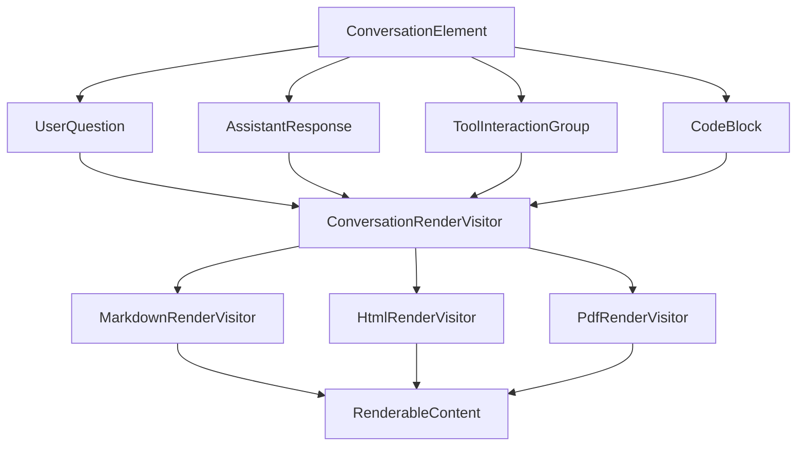

# 领域模型架构设计

## 概述

本文档描述了Show Me The Talk的领域模型重构设计，旨在解决当前Markdown导出格式可读性差的问题。通过实现语义化的对话模型和访问者模式的渲染架构，我们将实现清晰的视觉层次和多格式输出支持。

## 问题分析

### 当前问题

1. **视觉层次缺失**：所有消息类型（用户问题、助手回答、工具调用）在输出中看起来完全相同
2. **语义信息丢失**：无法区分内容的重要性和上下文语义
3. **格式耦合**：渲染逻辑与数据模型紧密耦合，难以支持多种输出格式
4. **可读性差**：长对话中用户难以快速定位关键信息

### 设计目标

1. **语义化建模**：将对话元素按语义重要性和类型进行分类
2. **渲染分离**：实现领域模型与展示格式的完全解耦
3. **视觉层次**：建立清晰的信息层次结构
4. **多格式支持**：支持Markdown、HTML、PDF等多种输出格式
5. **可扩展性**：便于添加新的内容类型和渲染格式

## 核心设计原理

### 访问者模式 + 渲染上下文策略

我们采用访问者模式(Visitor Pattern)结合渲染上下文策略(Rendering Context Strategy)的架构设计：



### 设计原则

1. **单一职责**：每个领域实体只关注自身的业务逻辑
2. **开闭原则**：对扩展开放（新格式），对修改封闭（现有模型）
3. **依赖倒置**：高层模块不依赖低层模块，都依赖抽象
4. **接口隔离**：渲染接口按职责细分

## 领域模型设计

### 核心抽象

#### 1. ConversationElement - 对话元素基类

```typescript
// 对话元素类型枚举
export enum ConversationElementType {
  USER_QUESTION = 'user_question',           // 用户问题
  ASSISTANT_RESPONSE = 'assistant_response', // 助手回答
  TOOL_INTERACTION = 'tool_interaction',     // 工具交互
  CODE_BLOCK = 'code_block',                 // 代码块
  SYSTEM_MESSAGE = 'system_message',         // 系统消息
  ERROR_MESSAGE = 'error_message',           // 错误消息
  METADATA = 'metadata'                      // 元数据
}

// 内容重要性分级
export enum ContentImportance {
  PRIMARY = 'primary',     // 主要内容：用户问题、主要回答
  SECONDARY = 'secondary', // 次要内容：工具交互、代码块
  TERTIARY = 'tertiary'    // 三级内容：系统消息、元数据
}

// 对话元素抽象基类
export abstract class ConversationElement {
  constructor(
    public readonly id: string,
    public readonly timestamp: Date,
    public readonly type: ConversationElementType,
    public readonly importance: ContentImportance,
    public readonly turnNumber: number = 0
  ) {}

  // 访问者模式核心方法
  abstract accept(visitor: ConversationRenderVisitor): RenderableContent;
  
  // 获取语义上下文
  abstract getSemanticContext(): SemanticContext;
  
  // 获取内容摘要（用于列表显示）
  abstract getSummary(): string;
  
  // 检查是否包含特定类型的内容
  abstract hasContentType(type: string): boolean;
}
```

#### 2. SemanticContext - 语义上下文

```typescript
// 语义上下文类
export class SemanticContext {
  constructor(
    public readonly isUserInitiated: boolean,      // 是否用户发起
    public readonly hasCodeContent: boolean,       // 是否包含代码
    public readonly isToolResult: boolean,         // 是否为工具结果
    public readonly conversationTurn: number,      // 对话轮次
    public readonly contentCategory: ContentCategory, // 内容分类
    public readonly relatedElements: string[] = [], // 关联元素ID
    public readonly metadata: Record<string, any> = {} // 扩展元数据
  ) {}
}

// 内容分类枚举
export enum ContentCategory {
  QUESTION = 'question',     // 问题
  ANSWER = 'answer',         // 回答
  ACTION = 'action',         // 操作
  RESULT = 'result',         // 结果
  METADATA = 'metadata',     // 元数据
  SYSTEM = 'system'          // 系统
}
```

### 具体领域实体

#### 1. UserQuestion - 用户问题

```typescript
export class UserQuestion extends ConversationElement {
  constructor(
    id: string,
    timestamp: Date,
    public readonly content: string,
    public readonly context: SemanticContext,
    public readonly isFollowUp: boolean = false,      // 是否为跟进问题
    public readonly previousQuestionId?: string,      // 前一个问题ID
    public readonly complexity: QuestionComplexity = QuestionComplexity.SIMPLE,
    public readonly intent: QuestionIntent = QuestionIntent.GENERAL
  ) {
    super(id, timestamp, ConversationElementType.USER_QUESTION, ContentImportance.PRIMARY);
  }

  accept(visitor: ConversationRenderVisitor): RenderableContent {
    return visitor.visitUserQuestion(this);
  }

  getSemanticContext(): SemanticContext {
    return this.context;
  }

  getSummary(): string {
    const maxLength = 100;
    const summary = this.content.length > maxLength 
      ? this.content.substring(0, maxLength) + '...'
      : this.content;
    
    return `${this.isFollowUp ? '↳ ' : ''}${summary}`;
  }

  hasContentType(type: string): boolean {
    switch (type) {
      case 'code':
        return /```|`/.test(this.content);
      case 'question':
        return /\?/.test(this.content);
      case 'multiline':
        return this.content.includes('\n');
      default:
        return false;
    }
  }

  // 领域方法：判断问题类型
  getQuestionType(): 'how-to' | 'what-is' | 'why' | 'debug' | 'implement' | 'explain' {
    const content = this.content.toLowerCase();
    if (content.includes('how to') || content.includes('how can')) return 'how-to';
    if (content.includes('what is') || content.includes('what are')) return 'what-is';
    if (content.includes('why') || content.includes('because')) return 'why';
    if (content.includes('error') || content.includes('bug') || content.includes('fix')) return 'debug';
    if (content.includes('implement') || content.includes('create') || content.includes('build')) return 'implement';
    if (content.includes('explain') || content.includes('understand')) return 'explain';
    return 'how-to';
  }
}

// 问题复杂度枚举
export enum QuestionComplexity {
  SIMPLE = 'simple',     // 简单问题
  MODERATE = 'moderate', // 中等复杂度
  COMPLEX = 'complex'    // 复杂问题
}

// 问题意图枚举
export enum QuestionIntent {
  GENERAL = 'general',           // 一般询问
  IMPLEMENTATION = 'implementation', // 实现需求
  DEBUGGING = 'debugging',       // 调试求助
  LEARNING = 'learning',         // 学习了解
  OPTIMIZATION = 'optimization'  // 优化改进
}
```

#### 2. AssistantResponse - 助手回答

```typescript
export class AssistantResponse extends ConversationElement {
  constructor(
    id: string,
    timestamp: Date,
    public readonly textContent: string,
    public readonly codeBlocks: CodeBlock[],
    public readonly toolUses: ToolUse[],
    public readonly model: string,
    public readonly usage: TokenUsage,
    public readonly reasoning?: string,  // 推理过程
    public readonly confidence?: number  // 置信度
  ) {
    super(id, timestamp, ConversationElementType.ASSISTANT_RESPONSE, ContentImportance.PRIMARY);
  }

  accept(visitor: ConversationRenderVisitor): RenderableContent {
    return visitor.visitAssistantResponse(this);
  }

  getSemanticContext(): SemanticContext {
    return new SemanticContext(
      false,                                    // 非用户发起
      this.codeBlocks.length > 0,              // 是否包含代码
      false,                                   // 非工具结果
      this.turnNumber,                         // 对话轮次
      ContentCategory.ANSWER,                  // 回答类型
      this.toolUses.map(tool => tool.id),     // 关联工具
      {
        model: this.model,
        tokenUsage: this.usage,
        confidence: this.confidence
      }
    );
  }

  getSummary(): string {
    const wordCount = this.textContent.split(/\s+/).length;
    const codeBlockCount = this.codeBlocks.length;
    const toolCount = this.toolUses.length;
    
    let summary = `${wordCount}词回答`;
    if (codeBlockCount > 0) summary += `, ${codeBlockCount}个代码块`;
    if (toolCount > 0) summary += `, ${toolCount}个工具调用`;
    
    return summary;
  }

  hasContentType(type: string): boolean {
    switch (type) {
      case 'code':
        return this.codeBlocks.length > 0;
      case 'tools':
        return this.toolUses.length > 0;
      case 'long':
        return this.textContent.length > 1000;
      case 'reasoning':
        return Boolean(this.reasoning);
      default:
        return false;
    }
  }

  // 领域方法：获取响应类型
  getResponseType(): 'explanation' | 'code-solution' | 'guidance' | 'analysis' | 'mixed' {
    const hasCode = this.codeBlocks.length > 0;
    const hasTools = this.toolUses.length > 0;
    const textLength = this.textContent.length;
    
    if (hasCode && hasTools) return 'mixed';
    if (hasCode) return 'code-solution';
    if (hasTools) return 'analysis';
    if (textLength > 500) return 'explanation';
    return 'guidance';
  }

  // 领域方法：计算内容复杂度
  getComplexityScore(): number {
    let score = 0;
    score += Math.min(this.textContent.length / 100, 10); // 文本长度
    score += this.codeBlocks.length * 2;                  // 代码块权重
    score += this.toolUses.length * 1.5;                  // 工具使用权重
    return Math.round(score);
  }
}

// 代码块实体
export class CodeBlock extends ConversationElement {
  constructor(
    id: string,
    timestamp: Date,
    public readonly language: string,
    public readonly content: string,
    public readonly filename?: string,
    public readonly startLine?: number,
    public readonly endLine?: number,
    public readonly purpose?: CodePurpose
  ) {
    super(id, timestamp, ConversationElementType.CODE_BLOCK, ContentImportance.SECONDARY);
  }

  accept(visitor: ConversationRenderVisitor): RenderableContent {
    return visitor.visitCodeBlock(this);
  }

  getSemanticContext(): SemanticContext {
    return new SemanticContext(
      false,
      true,                    // 总是包含代码
      false,
      this.turnNumber,
      ContentCategory.ANSWER,
      [],
      {
        language: this.language,
        filename: this.filename,
        lineCount: this.content.split('\n').length
      }
    );
  }

  getSummary(): string {
    const lines = this.content.split('\n').length;
    const filename = this.filename ? ` (${this.filename})` : '';
    return `${this.language} 代码${filename} - ${lines}行`;
  }

  hasContentType(type: string): boolean {
    return type === 'code' || type === this.language;
  }
}

// 代码用途枚举
export enum CodePurpose {
  EXAMPLE = 'example',       // 示例代码
  SOLUTION = 'solution',     // 解决方案
  FIX = 'fix',              // 修复代码
  REFACTOR = 'refactor',    // 重构代码
  TEST = 'test',            // 测试代码
  CONFIG = 'config'         // 配置代码
}
```

#### 3. ToolInteractionGroup - 工具交互组

```typescript
export class ToolInteractionGroup extends ConversationElement {
  constructor(
    id: string,
    timestamp: Date,
    public readonly interactions: ToolInteraction[],
    public readonly purpose: ToolInteractionPurpose,
    public readonly description: string,
    public readonly isSuccessful: boolean = true
  ) {
    super(id, timestamp, ConversationElementType.TOOL_INTERACTION, ContentImportance.SECONDARY);
  }

  accept(visitor: ConversationRenderVisitor): RenderableContent {
    return visitor.visitToolInteractionGroup(this);
  }

  getSemanticContext(): SemanticContext {
    const toolTypes = [...new Set(this.interactions.map(i => i.getType()))];
    
    return new SemanticContext(
      false,
      this.hasCodeOperations(),
      true,                    // 是工具结果
      this.turnNumber,
      ContentCategory.ACTION,
      this.interactions.map(i => i.id),
      {
        purpose: this.purpose,
        toolTypes: toolTypes,
        operationCount: this.interactions.length,
        successful: this.isSuccessful
      }
    );
  }

  getSummary(): string {
    const toolTypeCounts = this.getToolTypeCounts();
    const summaryParts = Object.entries(toolTypeCounts)
      .map(([type, count]) => `${count}个${this.getToolTypeDisplayName(type)}`)
      .slice(0, 3); // 只显示前3种类型
    
    return `${this.description} (${summaryParts.join(', ')})`;
  }

  hasContentType(type: string): boolean {
    switch (type) {
      case 'tools':
        return true;
      case 'file-operations':
        return this.interactions.some(i => ['read', 'write', 'edit'].includes(i.getType()));
      case 'code-analysis':
        return this.interactions.some(i => ['grep', 'glob'].includes(i.getType()));
      case 'system-operations':
        return this.interactions.some(i => i.getType() === 'bash');
      default:
        return false;
    }
  }

  // 领域方法：检查是否包含代码操作
  private hasCodeOperations(): boolean {
    return this.interactions.some(i => 
      ['read', 'write', 'edit', 'grep', 'glob'].includes(i.getType())
    );
  }

  // 领域方法：获取工具类型统计
  private getToolTypeCounts(): Record<string, number> {
    const counts: Record<string, number> = {};
    for (const interaction of this.interactions) {
      const type = interaction.getType();
      counts[type] = (counts[type] || 0) + 1;
    }
    return counts;
  }

  // 领域方法：获取工具类型显示名称
  private getToolTypeDisplayName(type: string): string {
    const displayNames: Record<string, string> = {
      'read': '文件读取',
      'write': '文件写入',
      'edit': '文件编辑',
      'bash': '命令执行',
      'grep': '内容搜索',
      'glob': '文件查找'
    };
    return displayNames[type] || type;
  }
}

// 工具交互目的枚举
export enum ToolInteractionPurpose {
  FILE_ANALYSIS = 'file_analysis',       // 文件分析
  CODE_GENERATION = 'code_generation',   // 代码生成
  DEBUGGING = 'debugging',               // 调试
  SYSTEM_OPERATIONS = 'system_operations', // 系统操作
  RESEARCH = 'research',                 // 研究调查
  TESTING = 'testing',                   // 测试
  DOCUMENTATION = 'documentation'        // 文档编写
}
```

### 对话结构模型

#### 1. EnhancedConversation - 增强对话模型

```typescript
export class EnhancedConversation {
  private elements: ConversationElement[] = [];
  private flows: ConversationFlow[] = [];

  constructor(
    public readonly sessionId: string,
    public readonly projectContext: ProjectContext,
    public readonly startedAt: Date,
    public readonly title?: string,
    public readonly category?: ConversationCategory
  ) {}

  // 添加对话元素
  addElement(element: ConversationElement): void {
    this.elements.push(element);
    this.recomputeFlows();
  }

  // 获取所有元素（只读）
  getElements(): readonly ConversationElement[] {
    return [...this.elements];
  }

  // 获取对话流
  getConversationFlows(): readonly ConversationFlow[] {
    return [...this.flows];
  }

  // 使用访问者模式渲染
  renderWith(visitor: ConversationRenderVisitor): ConversationRenderResult {
    const renderedElements = this.elements.map(element => ({
      element,
      rendered: element.accept(visitor)
    }));
    
    return new ConversationRenderResult(
      renderedElements,
      this.generateTableOfContents(),
      this.generateMetadata()
    );
  }

  // 领域方法：重新计算对话流
  private recomputeFlows(): void {
    this.flows = [];
    let currentFlow: ConversationElement[] = [];
    let turnNumber = 1;

    for (const element of this.elements) {
      // 用户问题开始新的对话流
      if (element.type === ConversationElementType.USER_QUESTION && currentFlow.length > 0) {
        this.flows.push(new ConversationFlow(currentFlow, turnNumber - 1));
        currentFlow = [];
        turnNumber++;
      }
      
      // 更新元素的轮次号
      (element as any).turnNumber = turnNumber;
      currentFlow.push(element);
    }

    // 添加最后一个流
    if (currentFlow.length > 0) {
      this.flows.push(new ConversationFlow(currentFlow, turnNumber));
    }
  }

  // 领域方法：生成目录
  private generateTableOfContents(): TableOfContents {
    const entries = this.elements
      .filter(element => element.importance === ContentImportance.PRIMARY)
      .map(element => new TOCEntry(
        element.id,
        element.getSummary(),
        element.type,
        element.timestamp
      ));

    return new TableOfContents(entries);
  }

  // 领域方法：生成元数据
  private generateMetadata(): ConversationMetadata {
    const stats = this.calculateStatistics();
    
    return new ConversationMetadata(
      this.sessionId,
      this.projectContext,
      this.startedAt,
      this.elements[this.elements.length - 1]?.timestamp || this.startedAt,
      stats,
      this.category,
      this.inferConversationTopics()
    );
  }

  // 领域方法：计算统计信息
  private calculateStatistics(): ConversationStatistics {
    const userQuestions = this.elements.filter(e => e.type === ConversationElementType.USER_QUESTION);
    const assistantResponses = this.elements.filter(e => e.type === ConversationElementType.ASSISTANT_RESPONSE);
    const toolInteractions = this.elements.filter(e => e.type === ConversationElementType.TOOL_INTERACTION);
    const codeBlocks = this.elements.filter(e => e.type === ConversationElementType.CODE_BLOCK);

    return new ConversationStatistics(
      this.elements.length,
      userQuestions.length,
      assistantResponses.length,
      toolInteractions.length,
      codeBlocks.length,
      this.flows.length
    );
  }

  // 领域方法：推断对话主题
  private inferConversationTopics(): string[] {
    // 基于内容分析推断主题
    const topics: string[] = [];
    
    // 分析问题类型
    const questionTypes = this.elements
      .filter(e => e instanceof UserQuestion)
      .map(e => (e as UserQuestion).getQuestionType());
    
    if (questionTypes.includes('implement')) topics.push('实现开发');
    if (questionTypes.includes('debug')) topics.push('问题调试');
    if (questionTypes.includes('explain')) topics.push('概念学习');
    
    // 分析工具使用
    const hasFileOps = this.elements.some(e => e.hasContentType('file-operations'));
    const hasCodeAnalysis = this.elements.some(e => e.hasContentType('code-analysis'));
    
    if (hasFileOps) topics.push('文件操作');
    if (hasCodeAnalysis) topics.push('代码分析');
    
    return topics.length > 0 ? topics : ['一般对话'];
  }
}

// 对话流模型
export class ConversationFlow {
  constructor(
    private readonly elements: ConversationElement[],
    public readonly turnNumber: number
  ) {}

  getUserQuestion(): UserQuestion | null {
    return this.elements.find(e => e instanceof UserQuestion) as UserQuestion || null;
  }

  getAssistantResponses(): AssistantResponse[] {
    return this.elements.filter(e => e instanceof AssistantResponse) as AssistantResponse[];
  }

  getToolInteractionGroups(): ToolInteractionGroup[] {
    return this.elements.filter(e => e instanceof ToolInteractionGroup) as ToolInteractionGroup[];
  }

  getCodeBlocks(): CodeBlock[] {
    return this.elements.filter(e => e instanceof CodeBlock) as CodeBlock[];
  }

  // 领域方法：获取主导内容类型
  getDominantContentType(): 'discussion' | 'coding' | 'analysis' | 'mixed' {
    const toolCount = this.getToolInteractionGroups().length;
    const codeCount = this.getCodeBlocks().length;
    const responseCount = this.getAssistantResponses().length;

    if (toolCount > responseCount) return 'analysis';
    if (codeCount > 0 && toolCount > 0) return 'mixed';
    if (codeCount > 0) return 'coding';
    return 'discussion';
  }

  // 领域方法：计算复杂度评分
  getComplexityScore(): number {
    let score = 0;
    
    // 问题复杂度
    const question = this.getUserQuestion();
    if (question) {
      score += question.complexity === QuestionComplexity.COMPLEX ? 3 : 
               question.complexity === QuestionComplexity.MODERATE ? 2 : 1;
    }
    
    // 回答复杂度
    const responses = this.getAssistantResponses();
    score += responses.reduce((sum, r) => sum + r.getComplexityScore(), 0);
    
    // 工具使用复杂度
    score += this.getToolInteractionGroups().length * 2;
    
    return score;
  }
}
```

## 渲染架构设计

### 访问者接口

```typescript
// 核心访问者接口
export interface ConversationRenderVisitor {
  visitUserQuestion(question: UserQuestion): RenderableContent;
  visitAssistantResponse(response: AssistantResponse): RenderableContent;
  visitToolInteractionGroup(group: ToolInteractionGroup): RenderableContent;
  visitCodeBlock(codeBlock: CodeBlock): RenderableContent;
}

// 可渲染内容值对象
export class RenderableContent {
  constructor(
    public readonly content: string,
    public readonly metadata: RenderMetadata
  ) {}

  // 辅助方法：创建带样式的内容
  static create(content: string, style: VisualStyle, options: Partial<RenderMetadata> = {}): RenderableContent {
    const metadata = new RenderMetadata(
      options.headingLevel || 3,
      options.isCollapsible || false,
      options.syntaxHighlighting || null,
      style,
      options.hasCallout || false,
      options.customClasses || [],
      options.attributes || {}
    );
    return new RenderableContent(content, metadata);
  }
}

// 渲染元数据
export class RenderMetadata {
  constructor(
    public readonly headingLevel: number,           // 标题层级
    public readonly isCollapsible: boolean,         // 是否可折叠
    public readonly syntaxHighlighting: string | null, // 语法高亮
    public readonly visualStyle: VisualStyle,       // 视觉样式
    public readonly hasCallout: boolean = false,    // 是否有标注框
    public readonly customClasses: string[] = [],   // 自定义CSS类
    public readonly attributes: Record<string, string> = {} // 自定义属性
  ) {}
}

// 视觉样式枚举
export enum VisualStyle {
  PROMINENT = 'prominent',      // 突出显示（用户问题）
  STANDARD = 'standard',        // 标准显示（助手回答）
  SUBTLE = 'subtle',           // 低调显示（工具交互）
  CODE = 'code',               // 代码样式
  METADATA = 'metadata',       // 元数据样式
  WARNING = 'warning',         // 警告样式
  SUCCESS = 'success',         // 成功样式
  ERROR = 'error'              // 错误样式
}
```

### Markdown渲染实现

```typescript
// Markdown访问者实现
export class MarkdownRenderVisitor implements ConversationRenderVisitor {
  constructor(
    private readonly options: MarkdownRenderOptions = new MarkdownRenderOptions()
  ) {}

  visitUserQuestion(question: UserQuestion): RenderableContent {
    const headingLevel = question.isFollowUp ? 4 : 2;
    const icon = this.getQuestionIcon(question.getQuestionType());
    const prefix = question.isFollowUp ? '↳ ' : '';
    
    let content = `${'#'.repeat(headingLevel)} ${icon} ${prefix}${question.content}\n\n`;
    
    // 添加问题元数据（如果启用）
    if (this.options.includeQuestionMetadata) {
      content += this.renderQuestionMetadata(question);
    }
    
    return RenderableContent.create(content, VisualStyle.PROMINENT, {
      headingLevel,
      hasCallout: question.complexity === QuestionComplexity.COMPLEX
    });
  }

  visitAssistantResponse(response: AssistantResponse): RenderableContent {
    let content = `**🤖 Assistant Response:**\n\n${response.textContent}\n\n`;
    
    // 渲染代码块
    if (response.codeBlocks.length > 0) {
      content += '\n**Code:**\n\n';
      for (const codeBlock of response.codeBlocks) {
        const renderedCode = codeBlock.accept(this);
        content += renderedCode.content;
      }
    }
    
    // 渲染工具使用信息
    if (response.toolUses.length > 0 && this.options.includeToolSummary) {
      content += this.renderToolUsageSummary(response.toolUses);
    }
    
    // 添加响应元数据（折叠）
    if (this.options.includeResponseMetadata) {
      content += this.renderResponseMetadataSection(response);
    }
    
    return RenderableContent.create(content, VisualStyle.STANDARD, {
      headingLevel: 3
    });
  }

  visitToolInteractionGroup(group: ToolInteractionGroup): RenderableContent {
    const summary = `🔧 ${group.description} (${group.interactions.length}个操作)`;
    const statusIcon = group.isSuccessful ? '✅' : '❌';
    
    let content = `<details>\n<summary><strong>${statusIcon} ${summary}</strong></summary>\n\n`;
    
    // 按类型分组显示工具交互
    const groupedInteractions = this.groupInteractionsByType(group.interactions);
    
    for (const [type, interactions] of Object.entries(groupedInteractions)) {
      if (interactions.length > 0) {
        content += `**${this.getToolTypeDisplayName(type)}:**\n`;
        for (const interaction of interactions) {
          content += `- ${interaction.getSummary()}\n`;
        }
        content += '\n';
      }
    }
    
    content += `</details>\n\n`;
    
    return RenderableContent.create(content, VisualStyle.SUBTLE, {
      isCollapsible: true,
      hasCallout: !group.isSuccessful
    });
  }

  visitCodeBlock(codeBlock: CodeBlock): RenderableContent {
    const filename = codeBlock.filename ? ` title="${codeBlock.filename}"` : '';
    const lineNumbers = this.options.includeLineNumbers && codeBlock.startLine 
      ? ` {${codeBlock.startLine}-${codeBlock.endLine || codeBlock.startLine}}` 
      : '';
    
    const content = `\`\`\`${codeBlock.language}${filename}${lineNumbers}\n${codeBlock.content}\n\`\`\`\n\n`;
    
    return RenderableContent.create(content, VisualStyle.CODE, {
      syntaxHighlighting: codeBlock.language
    });
  }

  // 辅助方法：获取问题图标
  private getQuestionIcon(type: string): string {
    const icons: Record<string, string> = {
      'how-to': '🙋',
      'what-is': '🤔',
      'why': '❓',
      'debug': '🐛',
      'implement': '⚡',
      'explain': '📚'
    };
    return icons[type] || '💬';
  }

  // 辅助方法：渲染问题元数据
  private renderQuestionMetadata(question: UserQuestion): string {
    const complexity = question.complexity.charAt(0).toUpperCase() + question.complexity.slice(1);
    const intent = question.intent.charAt(0).toUpperCase() + question.intent.slice(1);
    
    return `<div class="question-metadata">\n` +
           `<small><em>复杂度: ${complexity} | 意图: ${intent}</em></small>\n` +
           `</div>\n\n`;
  }

  // 辅助方法：渲染响应元数据
  private renderResponseMetadataSection(response: AssistantResponse): string {
    return `<details>\n<summary><em>📊 Response Details</em></summary>\n\n` +
           `- **Model**: ${response.model}\n` +
           `- **Tokens**: ${response.usage.inputTokens} in, ${response.usage.outputTokens} out\n` +
           `- **Response Type**: ${response.getResponseType()}\n` +
           `- **Complexity Score**: ${response.getComplexityScore()}\n` +
           (response.confidence ? `- **Confidence**: ${Math.round(response.confidence * 100)}%\n` : '') +
           `\n</details>\n\n`;
  }

  // 辅助方法：按类型分组工具交互
  private groupInteractionsByType(interactions: ToolInteraction[]): Record<string, ToolInteraction[]> {
    const grouped: Record<string, ToolInteraction[]> = {};
    for (const interaction of interactions) {
      const type = interaction.getType();
      if (!grouped[type]) grouped[type] = [];
      grouped[type].push(interaction);
    }
    return grouped;
  }
}

// Markdown渲染选项
export class MarkdownRenderOptions {
  constructor(
    public readonly includeTableOfContents: boolean = true,
    public readonly includeMetadata: boolean = true,
    public readonly includeQuestionMetadata: boolean = false,
    public readonly includeResponseMetadata: boolean = true,
    public readonly includeToolSummary: boolean = true,
    public readonly includeLineNumbers: boolean = false,
    public readonly collapsibleSections: boolean = true,
    public readonly syntaxHighlighting: boolean = true,
    public readonly customTheme?: MarkdownTheme
  ) {}
}
```

### HTML渲染实现

```typescript
// HTML访问者实现
export class HtmlRenderVisitor implements ConversationRenderVisitor {
  constructor(
    private readonly options: HtmlRenderOptions = new HtmlRenderOptions()
  ) {}

  visitUserQuestion(question: UserQuestion): RenderableContent {
    const headingTag = `h${Math.min(question.isFollowUp ? 4 : 2, 6)}`;
    const questionClass = this.getQuestionCssClass(question);
    const icon = this.getQuestionIcon(question.getQuestionType());
    
    const content = `
    <div class="conversation-element user-question ${questionClass}">
      <${headingTag} class="question-header">
        <span class="question-icon">${icon}</span>
        <span class="question-content">${this.escapeHtml(question.content)}</span>
      </${headingTag}>
      ${this.options.includeMetadata ? this.renderQuestionMetadataHtml(question) : ''}
    </div>
    `;
    
    return RenderableContent.create(content, VisualStyle.PROMINENT, {
      customClasses: [questionClass],
      attributes: { 
        'data-question-type': question.getQuestionType(),
        'data-complexity': question.complexity
      }
    });
  }

  visitAssistantResponse(response: AssistantResponse): RenderableContent {
    const responseClass = this.getResponseCssClass(response);
    
    let content = `
    <div class="conversation-element assistant-response ${responseClass}">
      <div class="response-header">
        <span class="response-icon">🤖</span>
        <span class="response-label">Assistant Response</span>
        ${this.renderResponseBadges(response)}
      </div>
      <div class="response-content">
        ${this.renderFormattedText(response.textContent)}
      </div>
    `;
    
    // 渲染代码块
    if (response.codeBlocks.length > 0) {
      content += '<div class="code-blocks">';
      for (const codeBlock of response.codeBlocks) {
        const renderedCode = codeBlock.accept(this);
        content += renderedCode.content;
      }
      content += '</div>';
    }
    
    // 渲染元数据
    if (this.options.includeMetadata) {
      content += this.renderResponseMetadataHtml(response);
    }
    
    content += '</div>';
    
    return RenderableContent.create(content, VisualStyle.STANDARD, {
      customClasses: [responseClass],
      attributes: {
        'data-model': response.model,
        'data-response-type': response.getResponseType()
      }
    });
  }

  visitToolInteractionGroup(group: ToolInteractionGroup): RenderableContent {
    const groupClass = group.isSuccessful ? 'successful' : 'failed';
    const statusIcon = group.isSuccessful ? '✅' : '❌';
    
    const content = `
    <div class="conversation-element tool-interaction-group ${groupClass}">
      <details class="tool-interaction-details">
        <summary class="tool-interaction-summary">
          <span class="status-icon">${statusIcon}</span>
          <span class="interaction-title">${this.escapeHtml(group.description)}</span>
          <span class="interaction-count">(${group.interactions.length}个操作)</span>
        </summary>
        <div class="tool-interactions">
          ${this.renderToolInteractionsHtml(group.interactions)}
        </div>
      </details>
    </div>
    `;
    
    return RenderableContent.create(content, VisualStyle.SUBTLE, {
      isCollapsible: true,
      customClasses: [groupClass],
      attributes: {
        'data-purpose': group.purpose,
        'data-success': group.isSuccessful.toString()
      }
    });
  }

  visitCodeBlock(codeBlock: CodeBlock): RenderableContent {
    const content = `
    <div class="code-block-container">
      ${codeBlock.filename ? `<div class="code-filename">${this.escapeHtml(codeBlock.filename)}</div>` : ''}
      <pre class="code-block"><code class="language-${codeBlock.language}">${this.escapeHtml(codeBlock.content)}</code></pre>
    </div>
    `;
    
    return RenderableContent.create(content, VisualStyle.CODE, {
      syntaxHighlighting: codeBlock.language,
      customClasses: [`language-${codeBlock.language}`],
      attributes: {
        'data-language': codeBlock.language,
        'data-purpose': codeBlock.purpose || 'general'
      }
    });
  }

  // 辅助方法实现...
  private escapeHtml(text: string): string {
    return text
      .replace(/&/g, '&amp;')
      .replace(/</g, '&lt;')
      .replace(/>/g, '&gt;')
      .replace(/"/g, '&quot;')
      .replace(/'/g, '&#39;');
  }

  private renderFormattedText(text: string): string {
    // 处理Markdown格式到HTML
    return text
      .replace(/\*\*(.*?)\*\*/g, '<strong>$1</strong>')
      .replace(/\*(.*?)\*/g, '<em>$1</em>')
      .replace(/`(.*?)`/g, '<code>$1</code>')
      .replace(/\n/g, '<br>');
  }
}

// HTML渲染选项
export class HtmlRenderOptions {
  constructor(
    public readonly includeMetadata: boolean = true,
    public readonly includeSyntaxHighlighting: boolean = true,
    public readonly theme: HtmlTheme = HtmlTheme.DEFAULT,
    public readonly customStylesheet?: string,
    public readonly includeInteractivity: boolean = false
  ) {}
}
```

## 渲染结果模型

```typescript
// 渲染结果包装器
export class ConversationRenderResult {
  constructor(
    public readonly renderedElements: RenderedElement[],
    public readonly tableOfContents: TableOfContents,
    public readonly metadata: ConversationMetadata
  ) {}

  // 生成完整的渲染输出
  generateOutput(format: RenderFormat): string {
    switch (format) {
      case RenderFormat.MARKDOWN:
        return this.generateMarkdownOutput();
      case RenderFormat.HTML:
        return this.generateHtmlOutput();
      default:
        throw new Error(`Unsupported render format: ${format}`);
    }
  }

  private generateMarkdownOutput(): string {
    let output = '';
    
    // 添加标题和元数据
    output += `# ${this.metadata.getDisplayTitle()}\n\n`;
    output += this.metadata.renderMarkdownHeader();
    
    // 添加目录
    if (this.tableOfContents.hasEntries()) {
      output += '\n## 📋 目录\n\n';
      output += this.tableOfContents.renderMarkdown();
      output += '\n---\n\n';
    }
    
    // 添加渲染的内容
    for (const renderedElement of this.renderedElements) {
      output += renderedElement.rendered.content;
      
      // 添加分隔符（除了最后一个元素）
      if (renderedElement !== this.renderedElements[this.renderedElements.length - 1]) {
        output += '\n---\n\n';
      }
    }
    
    // 添加页脚
    output += this.metadata.renderMarkdownFooter();
    
    return output;
  }

  private generateHtmlOutput(): string {
    let output = `
    <!DOCTYPE html>
    <html lang="zh-CN">
    <head>
      <meta charset="UTF-8">
      <meta name="viewport" content="width=device-width, initial-scale=1.0">
      <title>${this.metadata.getDisplayTitle()}</title>
      <style>${this.getDefaultCSS()}</style>
    </head>
    <body>
      <div class="conversation-container">
        <header class="conversation-header">
          ${this.metadata.renderHtmlHeader()}
        </header>
    `;
    
    // 添加目录
    if (this.tableOfContents.hasEntries()) {
      output += `
        <nav class="table-of-contents">
          <h2>📋 目录</h2>
          ${this.tableOfContents.renderHtml()}
        </nav>
      `;
    }
    
    // 添加主要内容
    output += '<main class="conversation-content">';
    for (const renderedElement of this.renderedElements) {
      output += renderedElement.rendered.content;
    }
    output += '</main>';
    
    // 添加页脚
    output += `
        <footer class="conversation-footer">
          ${this.metadata.renderHtmlFooter()}
        </footer>
      </div>
    </body>
    </html>
    `;
    
    return output;
  }

  private getDefaultCSS(): string {
    return `
      .conversation-container { max-width: 1200px; margin: 0 auto; padding: 20px; }
      .user-question { background: #f0f9ff; border-left: 4px solid #3b82f6; padding: 15px; margin: 20px 0; }
      .assistant-response { background: #f9fafb; border-left: 4px solid #10b981; padding: 15px; margin: 20px 0; }
      .tool-interaction-group { background: #fef3c7; border-left: 4px solid #f59e0b; padding: 10px; margin: 15px 0; }
      .code-block { background: #1f2937; color: #f9fafb; padding: 15px; border-radius: 6px; }
      .question-header { color: #1e40af; margin: 0 0 10px 0; }
      .response-header { color: #059669; margin: 0 0 10px 0; }
      details { margin: 10px 0; }
      summary { cursor: pointer; font-weight: bold; }
    `;
  }
}

// 渲染元素包装器
export interface RenderedElement {
  element: ConversationElement;
  rendered: RenderableContent;
}

// 渲染格式枚举
export enum RenderFormat {
  MARKDOWN = 'markdown',
  HTML = 'html',
  PDF = 'pdf',
  PLAIN_TEXT = 'plain_text'
}
```

## 使用示例

### 基本使用

```typescript
// 创建增强的对话模型
const conversation = new EnhancedConversation(
  'session-123',
  projectContext,
  new Date(),
  'Domain Architecture Discussion'
);

// 添加对话元素
const userQuestion = new UserQuestion(
  'q1',
  new Date(),
  '如何改进Markdown导出的可读性？',
  new SemanticContext(true, false, false, 1, ContentCategory.QUESTION),
  false,
  undefined,
  QuestionComplexity.MODERATE,
  QuestionIntent.IMPLEMENTATION
);

const assistantResponse = new AssistantResponse(
  'r1',
  new Date(),
  '我建议使用访问者模式来分离渲染逻辑...',
  [codeBlock1, codeBlock2],
  [toolUse1, toolUse2],
  'claude-3.5-sonnet',
  new TokenUsage(1200, 2100)
);

conversation.addElement(userQuestion);
conversation.addElement(assistantResponse);

// 渲染为Markdown
const markdownVisitor = new MarkdownRenderVisitor(
  new MarkdownRenderOptions(true, true, false, true)
);
const markdownResult = conversation.renderWith(markdownVisitor);
const markdownOutput = markdownResult.generateOutput(RenderFormat.MARKDOWN);

// 渲染为HTML
const htmlVisitor = new HtmlRenderVisitor(
  new HtmlRenderOptions(true, true, HtmlTheme.MODERN)
);
const htmlResult = conversation.renderWith(htmlVisitor);
const htmlOutput = htmlResult.generateOutput(RenderFormat.HTML);
```

### 自定义访问者

```typescript
// 创建自定义的简化渲染访问者
export class SimplifiedRenderVisitor implements ConversationRenderVisitor {
  visitUserQuestion(question: UserQuestion): RenderableContent {
    const content = `Q: ${question.content}\n\n`;
    return RenderableContent.create(content, VisualStyle.PROMINENT);
  }

  visitAssistantResponse(response: AssistantResponse): RenderableContent {
    let content = `A: ${response.textContent}\n\n`;
    
    // 只显示代码块，不显示元数据
    if (response.codeBlocks.length > 0) {
      for (const codeBlock of response.codeBlocks) {
        content += `\`\`\`\n${codeBlock.content}\n\`\`\`\n\n`;
      }
    }
    
    return RenderableContent.create(content, VisualStyle.STANDARD);
  }

  visitToolInteractionGroup(group: ToolInteractionGroup): RenderableContent {
    // 简化的工具交互显示
    const content = `[Tools: ${group.description}]\n\n`;
    return RenderableContent.create(content, VisualStyle.SUBTLE);
  }

  visitCodeBlock(codeBlock: CodeBlock): RenderableContent {
    // 在简化模式中，代码块由AssistantResponse处理
    return RenderableContent.create('', VisualStyle.CODE);
  }
}
```

## 集成到现有架构

### 应用层服务更新

```typescript
// 更新ConversationApplicationService以支持新的渲染系统
export class ConversationApplicationService {
  constructor(
    private conversationRepository: ConversationRepository,
    private exportService: ExportService
  ) {}

  async exportConversationsWithEnhancedRendering(
    options: EnhancedExportOptions
  ): Promise<ExportResult> {
    // 加载对话数据
    const conversations = await this.conversationRepository.findAll(options.claudePath);
    
    // 转换为增强对话模型
    const enhancedConversations = conversations.map(conv => 
      this.convertToEnhancedConversation(conv)
    );
    
    // 应用过滤器
    const filteredConversations = this.applyFilters(enhancedConversations, options.filters);
    
    // 创建适当的访问者
    const visitor = this.createRenderVisitor(options.format, options.renderOptions);
    
    // 渲染和导出
    const results: ConversationRenderResult[] = [];
    for (const conversation of filteredConversations) {
      const renderResult = conversation.renderWith(visitor);
      results.push(renderResult);
    }
    
    return this.exportService.exportRenderResults(results, options);
  }

  private convertToEnhancedConversation(conversation: Conversation): EnhancedConversation {
    const enhanced = new EnhancedConversation(
      conversation.sessionId,
      conversation.projectContext,
      conversation.startedAt,
      conversation.title
    );

    // 转换消息为语义化元素
    for (const message of conversation.messages) {
      const elements = this.convertMessageToElements(message);
      elements.forEach(element => enhanced.addElement(element));
    }

    return enhanced;
  }

  private createRenderVisitor(
    format: RenderFormat, 
    options?: RenderOptions
  ): ConversationRenderVisitor {
    switch (format) {
      case RenderFormat.MARKDOWN:
        return new MarkdownRenderVisitor(options as MarkdownRenderOptions);
      case RenderFormat.HTML:
        return new HtmlRenderVisitor(options as HtmlRenderOptions);
      default:
        throw new Error(`Unsupported render format: ${format}`);
    }
  }
}
```

这个领域模型架构设计通过语义化建模和访问者模式，彻底解决了当前Markdown输出可读性差的问题，同时为未来的多格式支持和功能扩展奠定了坚实的基础。设计遵循DDD原则，保持了与现有架构的良好集成。