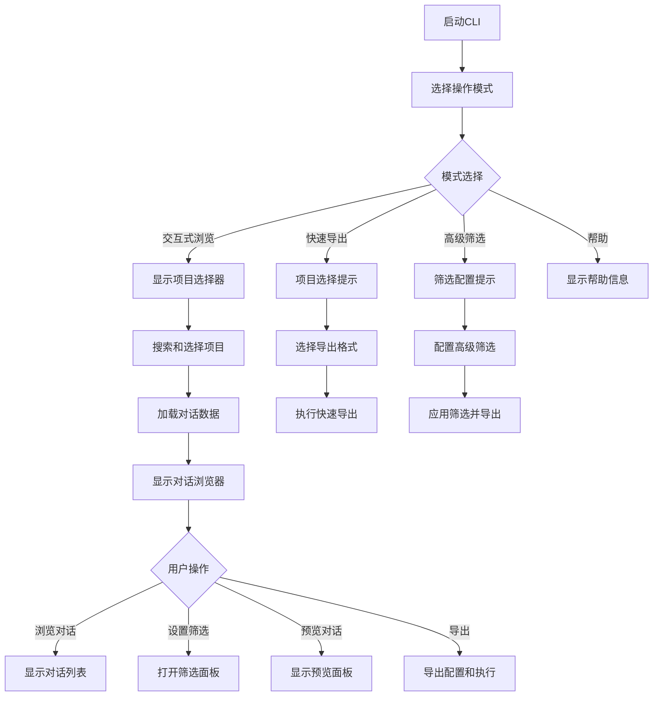

# Terminal UI Architecture Design

## 概述

本文档描述了Show Me The Talk CLI工具的Terminal UI (TUI) 架构设计，旨在提供直观的用户交互体验，解决当前直接读取整个仓库、缺乏项目选择和对话过滤功能的问题。

## 设计目标

### 用户体验目标
- **项目选择界面**：允许用户浏览和选择Claude项目目录
- **对话过滤系统**：提供多维度的对话筛选功能（日期、类型、工具使用等）
- **渐进式交互**：从简单选择到复杂配置的层次化用户流程
- **实时反馈**：用户输入时即时显示筛选和预览结果

### 技术目标
- **响应式界面**：支持不同终端尺寸的自适应布局
- **键盘导航**：完整的键盘操作支持，包括vim风格快捷键
- **性能优化**：大量对话数据的高效加载和渲染
- **可扩展架构**：易于添加新的交互模式和功能

## 技术选型

### 混合架构方案

我们采用 **Ink.js + Inquirer.js** 的混合架构：

| 组件 | 技术选择 | 适用场景 | 理由 |
|------|----------|----------|------|
| **复杂交互界面** | Ink.js | 项目浏览、实时过滤、预览 | React范式、组件化、实时更新能力 |
| **简单提示交互** | Inquirer.js | 用户选择、确认、配置输入 | 成熟稳定、API简洁、TypeScript支持良好 |
| **样式和主题** | Chalk | 颜色和格式化 | 轻量级、广泛兼容 |
| **图标和符号** | Figures | 跨平台图标显示 | 统一的视觉元素 |

### 依赖包清单

```json
{
  "dependencies": {
    "ink": "^4.4.1",
    "react": "^18.2.0",
    "@inquirer/prompts": "^3.3.0",
    "chalk": "^5.3.0",
    "figures": "^5.0.0",
    "ink-text-input": "^5.0.1",
    "ink-select-input": "^5.0.1",
    "ink-table": "^3.0.0"
  },
  "devDependencies": {
    "@types/react": "^18.2.0",
    "ink-testing-library": "^3.0.0"
  }
}
```

## 架构设计

### 整体架构图

```
src/presentation/cli/
├── interactive/                 # Ink.js 交互组件
│   ├── components/             # 可重用UI组件
│   │   ├── ProjectSelector.tsx
│   │   ├── ConversationBrowser.tsx
│   │   ├── FilterPanel.tsx
│   │   ├── ExportProgress.tsx
│   │   └── PreviewPane.tsx
│   ├── hooks/                  # 自定义React Hooks
│   │   ├── useProjects.ts
│   │   ├── useConversations.ts
│   │   └── useFilters.ts
│   ├── layouts/               # 布局组件
│   │   ├── MainLayout.tsx
│   │   └── SplitLayout.tsx
│   └── InteractiveCliService.ts
├── prompts/                    # Inquirer.js 提示
│   ├── projectPrompts.ts
│   ├── exportPrompts.ts
│   └── configPrompts.ts
├── commands/                   # 传统CLI命令
│   ├── exportCommand.ts
│   └── browseCommand.ts
└── HybridCliInterface.ts       # 主要CLI接口
```

### 核心组件设计

#### 1. HybridCliInterface - 主要CLI接口

```typescript
export class HybridCliInterface {
  constructor(
    private conversationService: ConversationApplicationService,
    private exportService: FileExportService
  ) {}

  async run(): Promise<void> {
    const mode = await this.selectOperationMode();
    
    switch (mode) {
      case 'interactive':
        return this.launchInteractiveBrowser();
      case 'quick-export':
        return this.quickExportWorkflow();
      case 'advanced-filter':
        return this.advancedFilteringWorkflow();
      case 'help':
        return this.showHelp();
    }
  }

  private async selectOperationMode(): Promise<OperationMode> {
    return await select({
      message: 'Show Me The Talk - 选择操作模式:',
      choices: [
        { 
          name: '🔍 交互式浏览器 - 浏览和预览对话', 
          value: 'interactive',
          description: '使用全屏界面浏览项目和对话'
        },
        { 
          name: '⚡ 快速导出 - 选择项目并导出', 
          value: 'quick-export',
          description: '快速选择项目和格式进行导出'
        },
        { 
          name: '🔧 高级过滤 - 自定义筛选条件', 
          value: 'advanced-filter',
          description: '使用高级条件筛选和导出对话'
        },
        { 
          name: '❓ 帮助和文档', 
          value: 'help' 
        }
      ],
      pageSize: 5
    });
  }
}
```

#### 2. ProjectSelector - 项目选择组件

```typescript
interface ProjectSelectorProps {
  projects: ProjectContext[];
  onSelect: (project: ProjectContext) => void;
  onCancel?: () => void;
}

export const ProjectSelector: React.FC<ProjectSelectorProps> = ({
  projects,
  onSelect,
  onCancel
}) => {
  const [selectedIndex, setSelectedIndex] = useState(0);
  const [searchTerm, setSearchTerm] = useState('');
  const [showDetails, setShowDetails] = useState(false);

  const filteredProjects = useMemo(() => {
    return projects.filter(project =>
      project.name.toLowerCase().includes(searchTerm.toLowerCase()) ||
      project.path.toLowerCase().includes(searchTerm.toLowerCase())
    );
  }, [projects, searchTerm]);

  useInput((input, key) => {
    if (key.upArrow) {
      setSelectedIndex(Math.max(0, selectedIndex - 1));
    } else if (key.downArrow) {
      setSelectedIndex(Math.min(filteredProjects.length - 1, selectedIndex + 1));
    } else if (key.return) {
      onSelect(filteredProjects[selectedIndex]);
    } else if (key.escape) {
      onCancel?.();
    } else if (input === 'd' || input === 'D') {
      setShowDetails(!showDetails);
    }
  });

  return (
    <Box flexDirection="column" padding={1}>
      <Text bold color="blue">
        📁 选择Claude项目 ({filteredProjects.length}/{projects.length})
      </Text>
      
      <Box marginY={1}>
        <Text color="gray">搜索: </Text>
        <TextInput
          value={searchTerm}
          onChange={setSearchTerm}
          placeholder="输入项目名称或路径..."
        />
      </Box>

      <Box flexDirection="column" marginTop={1}>
        {filteredProjects.map((project, index) => (
          <ProjectItem
            key={project.path}
            project={project}
            selected={index === selectedIndex}
            showDetails={showDetails}
          />
        ))}
      </Box>

      <Box marginTop={1}>
        <Text color="gray">
          ↑/↓: 导航 | Enter: 选择 | d: 切换详情 | Esc: 取消
        </Text>
      </Box>
    </Box>
  );
};
```

#### 3. ConversationBrowser - 对话浏览组件

```typescript
interface ConversationBrowserProps {
  conversations: Conversation[];
  filters: ConversationFilters;
  onFiltersChange: (filters: ConversationFilters) => void;
  onExport: (conversations: Conversation[]) => void;
}

export const ConversationBrowser: React.FC<ConversationBrowserProps> = ({
  conversations,
  filters,
  onFiltersChange,
  onExport
}) => {
  const [selectedTab, setSelectedTab] = useState<'list' | 'filters' | 'preview'>('list');
  const [selectedConversationIndex, setSelectedConversationIndex] = useState(0);

  const filteredConversations = useConversationFilter(conversations, filters);

  return (
    <Box flexDirection="column" height="100%">
      {/* 头部标签栏 */}
      <Box>
        <TabBar
          tabs={[
            { id: 'list', label: '📋 对话列表', count: filteredConversations.length },
            { id: 'filters', label: '🔍 筛选器', active: Object.keys(filters).length > 0 },
            { id: 'preview', label: '👁 预览', disabled: filteredConversations.length === 0 }
          ]}
          selectedTab={selectedTab}
          onTabSelect={setSelectedTab}
        />
      </Box>

      {/* 主要内容区域 */}
      <Box flexGrow={1} flexDirection="row">
        {selectedTab === 'list' && (
          <ConversationList
            conversations={filteredConversations}
            selectedIndex={selectedConversationIndex}
            onSelectionChange={setSelectedConversationIndex}
            onExport={onExport}
          />
        )}
        
        {selectedTab === 'filters' && (
          <FilterPanel
            filters={filters}
            onFiltersChange={onFiltersChange}
            conversationStats={getConversationStats(conversations)}
          />
        )}
        
        {selectedTab === 'preview' && filteredConversations.length > 0 && (
          <ConversationPreview
            conversation={filteredConversations[selectedConversationIndex]}
          />
        )}
      </Box>

      {/* 底部状态栏 */}
      <Box>
        <StatusBar
          totalConversations={conversations.length}
          filteredConversations={filteredConversations.length}
          selectedConversation={filteredConversations[selectedConversationIndex]}
        />
      </Box>
    </Box>
  );
};
```

#### 4. FilterPanel - 筛选面板组件

```typescript
export const FilterPanel: React.FC<FilterPanelProps> = ({
  filters,
  onFiltersChange,
  conversationStats
}) => {
  return (
    <Box flexDirection="column" padding={1}>
      <Text bold color="yellow">🔍 对话筛选器</Text>
      
      {/* 日期范围筛选 */}
      <Box flexDirection="column" marginTop={1}>
        <Text color="cyan">📅 日期范围</Text>
        <DateRangeFilter
          startDate={filters.startDate}
          endDate={filters.endDate}
          onChange={(startDate, endDate) => 
            onFiltersChange({ ...filters, startDate, endDate })
          }
        />
      </Box>

      {/* 对话类型筛选 */}
      <Box flexDirection="column" marginTop={1}>
        <Text color="cyan">🏷 对话类型</Text>
        <CheckboxGroup
          options={[
            { value: 'learning', label: '学习型对话', count: conversationStats.learning },
            { value: 'implementation', label: '实现任务', count: conversationStats.implementation },
            { value: 'debugging', label: '调试协助', count: conversationStats.debugging }
          ]}
          selected={filters.conversationTypes || []}
          onChange={(types) => 
            onFiltersChange({ ...filters, conversationTypes: types })
          }
        />
      </Box>

      {/* 工具使用筛选 */}
      <Box flexDirection="column" marginTop={1}>
        <Text color="cyan">🔧 工具使用</Text>
        <CheckboxGroup
          options={[
            { value: 'has-tools', label: '包含工具调用', count: conversationStats.withTools },
            { value: 'code-generation', label: '代码生成', count: conversationStats.codeGeneration },
            { value: 'file-operations', label: '文件操作', count: conversationStats.fileOperations }
          ]}
          selected={filters.toolUsage || []}
          onChange={(usage) => 
            onFiltersChange({ ...filters, toolUsage: usage })
          }
        />
      </Box>

      {/* 消息数量筛选 */}
      <Box flexDirection="column" marginTop={1}>
        <Text color="cyan">💬 消息数量</Text>
        <RangeFilter
          min={filters.messageCountRange?.min || 1}
          max={filters.messageCountRange?.max || conversationStats.maxMessageCount}
          onChange={(min, max) => 
            onFiltersChange({ 
              ...filters, 
              messageCountRange: { min, max }
            })
          }
        />
      </Box>

      {/* 操作按钮 */}
      <Box marginTop={2} flexDirection="row" gap={1}>
        <Button 
          label="🗑 清除所有"
          onClick={() => onFiltersChange({})}
        />
        <Button 
          label="💾 保存预设"
          onClick={() => saveFilterPreset(filters)}
        />
      </Box>
    </Box>
  );
};
```

## 用户交互流程

### 主要用户流程



### 键盘快捷键设计

| 快捷键 | 功能 | 适用界面 |
|--------|------|----------|
| `↑/↓` | 上下导航 | 所有列表界面 |
| `←/→` | 左右切换标签 | 对话浏览器 |
| `Enter` | 选择/确认 | 所有界面 |
| `Esc` | 返回/取消 | 所有界面 |
| `Space` | 切换选择状态 | 多选界面 |
| `/` | 快速搜索 | 列表界面 |
| `f` | 打开筛选器 | 对话浏览器 |
| `p` | 切换预览 | 对话浏览器 |
| `e` | 导出当前选择 | 对话浏览器 |
| `r` | 刷新数据 | 所有界面 |
| `h` | 显示帮助 | 所有界面 |
| `q` | 退出程序 | 所有界面 |

## 性能考虑

### 数据加载策略

1. **懒加载**：只在需要时加载对话详细内容
2. **分页显示**：大量对话数据分页处理
3. **虚拟滚动**：长列表使用虚拟滚动技术
4. **缓存机制**：缓存已加载的项目和对话数据

### 渲染优化

1. **React.memo**：防止不必要的组件重渲染
2. **useMemo/useCallback**：缓存计算结果和函数引用
3. **防抖搜索**：搜索输入使用防抖处理
4. **增量更新**：筛选结果增量更新

### 内存管理

```typescript
// 示例：对话数据的懒加载Hook
export const useConversations = (projectPath: string) => {
  const [conversations, setConversations] = useState<ConversationSummary[]>([]);
  const [loadedDetails, setLoadedDetails] = useState<Map<string, Conversation>>(new Map());
  const [loading, setLoading] = useState(false);

  const loadConversationDetails = useCallback(async (conversationId: string) => {
    if (loadedDetails.has(conversationId)) {
      return loadedDetails.get(conversationId);
    }

    const details = await conversationService.getConversationDetails(conversationId);
    setLoadedDetails(prev => new Map(prev).set(conversationId, details));
    return details;
  }, [loadedDetails]);

  // 内存清理
  useEffect(() => {
    return () => {
      setLoadedDetails(new Map());
    };
  }, [projectPath]);

  return {
    conversations,
    loadConversationDetails,
    loading
  };
};
```

## 测试策略

### 组件测试

```typescript
// 示例：ProjectSelector组件测试
describe('ProjectSelector', () => {
  const mockProjects: ProjectContext[] = [
    { name: 'project-1', path: '/path/to/project-1' },
    { name: 'project-2', path: '/path/to/project-2' }
  ];

  it('should display projects and handle selection', () => {
    const onSelect = vi.fn();
    const { lastFrame, stdin } = render(
      <ProjectSelector projects={mockProjects} onSelect={onSelect} />
    );

    expect(lastFrame()).toContain('project-1');
    expect(lastFrame()).toContain('project-2');

    // 模拟键盘操作
    stdin.write('\u001B[B'); // 下箭头
    stdin.write('\r');       // 回车

    expect(onSelect).toHaveBeenCalledWith(mockProjects[1]);
  });

  it('should filter projects based on search term', () => {
    const { lastFrame, stdin } = render(
      <ProjectSelector projects={mockProjects} onSelect={vi.fn()} />
    );

    // 输入搜索词
    stdin.write('project-1');

    expect(lastFrame()).toContain('project-1');
    expect(lastFrame()).not.toContain('project-2');
  });
});
```

### 集成测试

```typescript
// 示例：完整用户流程集成测试
describe('Interactive CLI Integration', () => {
  it('should complete full project selection and export workflow', async () => {
    const cliInterface = new HybridCliInterface(
      mockConversationService,
      mockExportService
    );

    // 模拟用户选择交互式模式
    mockInquirerResponse('interactive');
    
    // 模拟项目选择
    const { stdin } = renderInteractiveCLI();
    stdin.write('\r'); // 选择第一个项目

    // 验证对话浏览器启动
    expect(mockConversationService.getConversations).toHaveBeenCalled();
    
    // 模拟导出操作
    stdin.write('e'); // 按e键导出
    
    expect(mockExportService.export).toHaveBeenCalled();
  });
});
```

## 扩展性设计

### 插件系统

```typescript
// 扩展点接口
export interface TUIExtension {
  name: string;
  version: string;
  initialize(context: TUIContext): void;
  registerComponents?(): ComponentRegistry;
  registerCommands?(): CommandRegistry;
}

// 组件注册系统
export class ComponentRegistry {
  private components = new Map<string, React.ComponentType<any>>();

  register<T>(name: string, component: React.ComponentType<T>): void {
    this.components.set(name, component);
  }

  get<T>(name: string): React.ComponentType<T> | undefined {
    return this.components.get(name);
  }
}
```

### 主题系统

```typescript
// 主题配置接口
export interface TUITheme {
  colors: {
    primary: string;
    secondary: string;
    success: string;
    warning: string;
    error: string;
    background: string;
    text: string;
  };
  symbols: {
    selected: string;
    unselected: string;
    folder: string;
    file: string;
  };
}

// 主题提供者
export const ThemeProvider: React.FC<{ theme: TUITheme; children: React.ReactNode }> = ({
  theme,
  children
}) => {
  return (
    <ThemeContext.Provider value={theme}>
      {children}
    </ThemeContext.Provider>
  );
};
```

## 与现有架构集成

### DDD层次集成

```typescript
// 在基础设施层添加TUI服务
// src/infrastructure/tui/TUIService.ts
export class TUIService {
  constructor(
    private conversationService: ConversationApplicationService,
    private exportService: FileExportService
  ) {}

  async startInteractiveMode(options: TUIOptions): Promise<void> {
    const hybridInterface = new HybridCliInterface(
      this.conversationService,
      this.exportService
    );
    await hybridInterface.run();
  }
}

// 在容器中注册TUI服务
// src/infrastructure/container/Container.ts
export class Container {
  private registerTUIServices(): void {
    this.services.set('TUIService', new TUIService(
      this.get('ConversationApplicationService'),
      this.get('FileExportService')
    ));
  }
}
```

### CLI入口集成

```typescript
// 更新主CLI入口以支持TUI模式
// src/presentation/cli/cli.ts
export async function main(): Promise<void> {
  const program = new Command();
  
  program
    .name('show-me-the-talk')
    .description('Claude Code对话分析和导出工具');

  // 交互式模式命令
  program
    .command('interactive')
    .alias('i')
    .description('启动交互式Terminal UI界面')
    .action(async () => {
      const container = Container.getInstance();
      const tuiService = container.get<TUIService>('TUIService');
      await tuiService.startInteractiveMode({});
    });

  // 保持现有的非交互式命令
  program
    .command('export')
    .description('导出对话（非交互式）')
    .option('-p, --project <path>', '项目路径')
    .option('-f, --format <format>', '导出格式')
    .action(async (options) => {
      // 现有的导出逻辑
    });

  await program.parseAsync();
}
```

这个TUI架构设计为Show Me The Talk提供了完整的交互式用户界面解决方案，解决了当前缺乏项目选择和对话过滤功能的问题，同时保持了与现有DDD架构的良好集成。